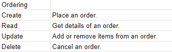

# Byte Size
Description: A food ordering app for our restaurant Byte Size, however for the meals our customer orders, we will match that meal and donate the same meal to the homeless!

# Description of Relationship

# Description of Constraints

# CRUD Actions

# User Stories

# Kanban Board

